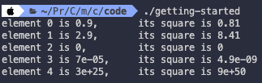
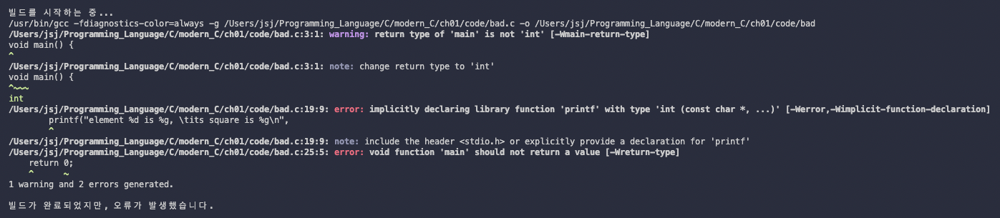

# 1장 들어가며

1장에서는 다음을 다룰 것이다.

- **imperative programming**(명령형 프로그래밍)

- 코드 컴파일 및 실행

## 1.1 imperative programming

C 언어는 마치 사람이 명령을 내리는 방식처럼 작업을 표현한다. 따라서 **imperative programming**(명령형 프로그래밍)이라고 부른다.

### <span style='background-color: #393E46; color: #F7F7F7'>&nbsp;&nbsp;&nbsp;📝 예제 1-1&nbsp;&nbsp;&nbsp;</span>

```C
#include <stdlib.h>
#include <stdio.h>

int main(void) {
    // 선언문
    double A[5] = {
        [0] = 0.9,
        [1] = 2.9,
        [4] = 3.E+25,
        [3] = .00007, 
    };

    for (size_t i = 0; i < 5; ++i) {
        printf("element %zu is %g, \tits square is %g\n",
            i,
            A[i],
            A[i]*A[i]);
    }

    return EXIT_SUCCESS;
}
```

실행 결과 터미널에는 다음과 같이 출력된다.

```
gcc getting-started.c -o getting-started && ".
/ch01/code/"getting-started
element 0 is 0.9,       its square is 0.81
element 1 is 2.9,       its square is 8.41
element 2 is 0,         its square is 0
element 3 is 7e-05,     its square is 4.9e-09
element 4 is 3e+25,     its square is 9e+50
```

이 출력들은 printf() 부분을 수행해서 얻은 결과이다. 이런 코드를 **instruction**(명령)이라고 한다. 이 instruction은 <U>'printf'란 function을 **call**(호출)</U>한다.

> C언어에서 **statement**(문장)이라고 부르는 경우가 더 많다. 하지만 instruction 쪽이 의미에 더 가깝다.

이 instruction 부분을 좀 더 상세하게 분석하면 다음과 같다.

```C
printf("element %zu is %g, \tits square is %g\n",
    i,
    A[i],
    A[i]*A[i]);
```

- "": **string literal**(스트링 리터럴). 안에 있는 text로, print할 text의 **format**(서식/형식)을 지정한다. 

  - %: **format specifier**(포맷 지정자). 예제에서는 세 가지를 사용했다.

---

## 1.2 컴파일하고 실행하기

그런데 작성한 program 코드는 하고 싶은 일을 표현했을 뿐으로, 하드디스크 어딘가에 저장된 txt 파일과 다를 바 없다. 이때 **compiler**(컴파일러)라 불리는 특별한 program으로 C 코드를 컴퓨터가 알아들을 수 있는 형태인 **binary**(바이너리) 또는 **executable**(실행 파일)로 번역해야 한다.

compiler의 명칭과 compiler에서 제공하는 **command-line argument**(명령줄 인수)는, program을 실행하는 **platform**(플랫폼)마다 다르다. 그 이유는 target binary code가 **platform dependent**(플랫폼 종속적)이기 때문이다.

앞서 터미널 출력을 다시 분석해 보자.

```
gcc getting-started.c -o getting-started && ".
/ch01/code/"getting-started
```

- gcc: compiler program

- -o getting-started: **compiler output**(컴파일러 출력)을 getting-started라는 파일에 저장한다.

- getting-started.c: **source file**로 C 코드가 담긴 파일 이름을 나타낸다.

> -lm(표준 수학 함수 추가)와 같은 여러 옵션이 더 존재한다.

compiler를 실행한 뒤 디렉터리에 getting-started라는 executable이 생성됐다. 터미널에서 다음과 같이 입력하면 executable을 실행할 수 있다.

```bash
./getting-started
```



앞서 본 것과 똑같이 출력된다. '**portable**(이식성이 있다.)'하다는 말이 바로 이런 뜻이다. program을 어디서 실행하든 **behavior**(동작)이 똑같다.

추가로 흔히 쓰이는 컴파일러 목록과 이에 따른 출력들을 보자.

> clang -Wall -lm -o getting-started getting-started.c

> gcc -std=c99 -Wall -lm -o getting-started getting-started.c

> icc -std=c99 -Wall -lm -o getting-started getting-started.c

이번에는 일부러 틀린 예제를 사용하여 compiler가 어떤 **diagnostic**(진단 정보)를 출력하는지 보자.

### <span style='background-color: #393E46; color: #F7F7F7'>&nbsp;&nbsp;&nbsp;📝 예제 1-2&nbsp;&nbsp;&nbsp;</span>

```c
// bad.c 파일
void main() {
    /* declaration(선언): 어떤 대상의 실제 내용을 
    compiler에게 알려주는 행위 */
    // definition(정의)와 차이는 memory address binding 유무로 구분할 수 있다.
    // 어떤 대상의 이름에 대응하는 memory상 address가 정해지면 definition(정의)
    // 그렇지 않고 이름만 정의하면 declaration(선언)
    int i;
    double A[5] = {
        9.0,
        2.9,
        3.E+25,
        .00007,
    };

    // 작업을 수행한다.
    for (i = 0; i < 5; ++i) {
        printf("element %d is %g, \tits square is %g\n",
            i,
            A[i],
            A[i]*A[i]);
    }

    return 0;
}
```

compile 시 다음과 같은 diagnostic이 출력된다.



이런 diagnostic은 길수록 많은 정보가 담긴 것이므로 오히려 도움이 된다. 이 diagnostic에서 제일 주목할 만한 힌트는 다음 두 가지다.

1. 'warning: return type of 'main' is not 'int'': main의 return 타입이 이상하다.

2. 'implicitly declaring library function 'printf'': printf function이 어디서 나온 것인지 지정하는 문장이 없다.

> 플랫폼에 따라 이런 diagnostic가 나오는 program에서 무조건 compile을 중단하도록 지정할 수 있다. gcc의 경우 -Werror 옵션이 이에 해당한다.

> **C program을 compile했을 때 경고 메세지는 하나도 없어야 한다.**

---

