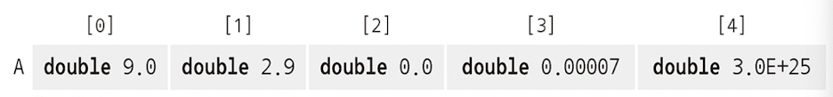

# 2 program의 핵심 구조

## 2.1 문법

C program의 전반적인 구조를 살펴보면, 특정한 문법에 따라 여러 텍스트 요소가 엮인 것을 알 수 있다.

- **special word**(특수어): 예제 1-1에서 본 **#include**, **int**, **void**, **double**, **for**, **return**과 같이 특별히 정의되어 변하지 않는 개념이나 기능을 의미한다.

  > 이런 identifier(식별자)를 directive(지시어), keyword(키워드), reserved(예약어)라 부른다.

- **punctuation**(구두점): C 언어는 program 구조와 관련된 구두점을 다양하게 제공한다.

  > {...}, (...), [...], /\*...\*/, <...>. 참고로 <...>는 드문 경우에만 논리적으로 동일한 문장의 한 줄 안에서만 사용할 수 있다.

  > seperator(구분자, terminator)는 크게 두 가지가 있다. 바로 ','(comma)와 ';'(semicolon)이다. 

  > 위와 같은 punctuation은 c언어에서 의미가 다양한 경우가 많기 때문에, 처음 개념을 익힐 때는 혼란스러울 수 있다.

- **comment**(주석): /* ... */(혹은 C++ 스타일인 //) 구문은 compiler에게 해당 내용이 주석임을 알려준다. 이에 따라 compiler는 해당 부분을 무시한다.

- **literal**(리터럴): 앞서 0,1,3,9.0,3E+25, .00007이나 "element %zu is %g, \tits square is %g\n" 같은 고정된 요소를 의미한다.

- **identifier**(식별자): program의 구성 요소에는 성격이 '이름' 같은 것들이 있다. 앞서 A, i, **main**, **printf**, **size_t**, **EXIT_SUCCESS**가 여기 해당된다.

  > A, i는 **data object**(variable)에 해당한다.

  > size_t는 object 종류를 지정하는 **type**에 해당한다.(_t라는 명명 규칙도 type을 나타낸다.)

  > main, printf는 function에 해당한다.

  > EXIT_SUCCESS는 constant에 해당한다.

- **function**(함수): 앞서 main 함수가 나온 문장들은, 코드에서 이 함수를 **defined**(정의)한 것이다. 

> 다시 말해 int main(void)라는 **declaration**(선언문) 뒤에 {...}로 묶은 **block**(블록) 안에 이 function이 수행할 일을 나열했다. 이 내부 코드가 main 함수의 **definition**(정의)이다.

- **operator**(연산자)

---

## 2.2 declaration(선언)

program에서 어떤 identifier를 사용하기 전에는, 그 identifier가 무엇을 가리키는지 compiler에게 알려 주도록 declaration(선언)해야 한다. 이것이 identifier와 keyword의 차이다.

> keyword는 language가 미리 defined했기 때문에, 따로 declaration하거나 다시 defined할 수 없다.

앞서 직접 declaration한 identifier를 보자.

```c
int main(void);
double A[5];
size_t i;
```

세 declaration은 일정한 패턴을 따른다. identifier가 갖는 특정한 속성과 identifier가 함께 명시된다.

- main 뒤에는 소괄호(parenthesis) (...)가 나온다. 따라서 declaration 대상은 type이 **int**인 function이란 것을 알 수 있다.

- A 뒤에는 꺽쇠괄호(bracket) [...]가 나온다. 따라서 declaration 대상은 **array**다.(double type element 5개로 구성된다.)

- i의 type은 size_t다.

> 따라서 세 declaration에서 지정한 type은 각각 int, double, size_t에 해당한다.

```c
size_t i;
```

i나 A는 data object(variable)이다. 이는 **value**(값)을 저장하는 이름 있는 요소라고 declaration한 것이다.


- 박스 전체가 object.

- 박스 종류가 type.

- 박스에 적인 이름이 label(identifier)이다.

다른 identifier인 printf, size_t, EXIT_SUCCESS와 관련된 declaration은 코드에 나오지 않는다. 이미 declaration된 상태이기 때문이며, .h파일에 저장되어 있다.(printf는 stdio.h, size_t와 EXIT_SUCCESS는 stdlib.h에 declaration되어 있다.)

> program에서 identifier가 visible(보이는)한 영역을 **scope**(스코프)라고 한다. identifier는 declaration이 속한 scope에 binding된다.

declaration 자체는 대상의 특징을 표현하기만 할 뿐이고, <U>실제로 생성되지는 않는다.</U> 따라서 같은 declaration을 여러 번 적는 것만으로는 문제가 발생하지 않는다.

하지만 어느 identifier에 서로 다른 declaration이 여러 개 나오면 문제가 생길 수 있으므로(compiler든 programmer든), 상충하는 declaration은 동시에 나올 수 없다.

앞서 예제에서 declaration에 따라 scope가 어떻게 나뉘었는지 보자.

```c
int main(void) {
    // 선언문
    double A[5] = {
        [0] = 0.9,
        [1] = 2.9,
        [4] = 3.E+25,
        [3] = .00007, 
    };

    for (size_t i = 0; i < 5; ++i) {
        printf("element %zu is %g, \tits square is %g\n",
            i,
            A[i],
            A[i]*A[i]);
    }

    return EXIT_SUCCESS;
}
```

- data object A: **main** declaration 안에서만 보인다. 즉, A의 scope는 declaration을 시작하는 line부터, main {...} block을 닫는 line까지다.

- data object i: **for** 구문에 binding되어, for 구문의 {...} block 마지막 문장까지다.(visible range가 가장 좁다.)

- main: {...} block에 담겨 있지 않기 때문에, declaration부터 파일의 끝까지가 scope이다.

A, i와 같이 block({...})으로 제한된 scope를 **block scope**(블록 스코프)라고 부른다.

main처럼 block({...})으로 감싸지 않은 scope를 **file scope**(파일 스코프)라고 부르며, file scope에 속한 identifier를 흔히 **global** identifier라 부른다.

---

## 2.3 definition(정의)

declaration이 identifier를 지정했다면, **definition**(정의)는 구체적인 value나 object를 지정한다.

복잡한 과정이기 때문에, 지금은 일단 variable은 항상 **initialization**(초기화)한다고 가정하자. initialization은 declaration 뒤에 나올 수 있는 구문으로, declaration 대상인 object의 초깃값을 지정한다.

```c
size_t i = 0;
```

위 구문은 variable i를 declaration하면서, 초깃값을 0으로 지정한 것이다. c 언어에서는 이렇게 declaration에 **initializer**(초기자, 이니셜라이저)를 함께 사용하는 방식으로 identifier에 object를 definition할 수 있다.

<U>**다시 말해 variable의 value를 저장할 공간을 제공하도록 compiler에 지시한다.**</U>

> **object는 initialization할 때 정의된다.**

```c
double A[5] = {
    [0] = 9.0,
    [1] = 2.9,
    [4] = 3.E+25,
    [3] = .00007,
};
```

위 구문은 여러 element로 구성되어 있다. A를 구성하는 5개 element의 값은 각각 9.0, 2.9, 0.0, 0.00007, 3.0E+25가 된다.



이런 방식을 **designated initializer**(지정 초기자)라고 부른다. 이렇게 initialization할 array element를 대괄호 안의 정수로 지정해서, 해당 element의 값을 initialization한다.

> c언어에서 initializer로 지정하지 않은 element의 value는 default value인 0으로 설정된다. A에서는 0.0으로 지정되었다.

array의 **index**(위치) 시작이 1이 아닌 0부터 시작하는 점에 주의하자. array의 <U>base point에서 떨어진 **offset**(오프셋, 정수 변위차를 의미한다.)을 나타낸다고 기억</U>하면 쉽다.

function을 definition하려면 declarative statement(선언문) 뒤에 내용을 중괄호 { ... }로 묶으면 된다.

> definition에 의해 i와 A는 **object**를 가리켰으며, main과 printf는 **function**을 가리켰다.

> object나 function을 declaration하는 statement는 여러 번 나올 수 있지만, <U>definition하는 statement는 고유해야 한다.</U> 또한 program이 작동하려면 사용하는 function과 object는 반드시 definition되어 있어야 한다.

---

## 2.4 statement(문장)

> 앞서 의미적인 면에서 statement이라는 단어보다는 instruction에 가깝다고 언급했다.

**statement**(문장)은 지금까지 declaration된 identifier를 다루는 방법을 compiler에게 알려 준다. 앞서 본 예제에서 statement는 다음과 같이 구성되어 있다.

```c
// ch01/getting-started.c
for (size_t i = 0; i < 5; ++i){
    printf("element %zu is %g, \tits square is %g\n",
        i,
        A[i],
        A[i]*A[i])
}

return EXIT_SUCCESS;
```

for과 return, ++ operator로 표현한 increment operation(증가 연산)이 등장했다. 이들은 앞서 살핀 printf function과는 다르다. 

---

### 2.4.1 iteration(반복)

앞서 for문은 printf statement를 여러 번 실행하라고 compiler에게 알려 준다. c 언어에서 정의하는 **domain iteration**(도메인 반복)의 가장 간단한 형태이며, 크게 네 부분으로 구성된다.

0. for (...) 뒤에 {} block 안에 있는 반복할 코드를 **loop body**(루프 바디)라고 부른다. (...) 안에서는 각각을 ;로 구분한다.

1. **loop variable**(루프 변수)인 i의 declaration, definition, initialzation이 나온다.(size_t i = 0;) 이 중에서 initialzation은 실행 전 단 한 번만 실행된다.

2. **loop condition**인 i < 5는 for문을 지속할 기간을 지정한다. i가 5보다 작은 동안은 계속 반복한다고 compiler에게 전달한다.

3. ++i 문은 iteration마다 실행된다.(한 번씩 돌 때마다 1이 증가한다.)

i가 0, 1, 2, 3, 4라는 **domain**(도메인, 해결하고자 하는 영역)에 대해 반복하기 때문에, iteration마다 i에 특정한 value를 지정할 수 있다.

> loop variable을 for문 앞에서 정의하기 보다는, for loop에서 반복 카운터라는 특수한 역할을 하도록 예제처럼 표기하는 편이 좋다.(즉, 꼭 for의 initialzation 부분에서 정의하라.)

---

## 2.4.2 function call(함수 호출)

**function call**(함수 호출)을 하면 현재 function(program 시작 시점에서는 main function)을 잠시 멈추고, 호출문으로 지정한 function으로 제어권을 넘긴다.

```c
// ch01/getting-started.c
printf("element %zu is %g, \tits square is %g\n",
    i,
    A[i],
    A[i]*[i]);
```

앞서 printf function을 call(호출)했다. 함수 호출문에서는 함수 이름뿐만 아니라, 예제의 i, A[i], A[i]*A[i]처럼 **argument**(인수)도 함께 지장할 때가 많다. 이렇게 지정한 argument의 value은 call한 function으로 전달된다.

그런데 여기서 중요한 점은, i가 argument의 일부이지만, printf function에서 이 i의 value 자체를 바꿀 수 없다는 점이다. 이런 호출 방식을 **call by value**(값 호출)이라고 한다. (반대로 call한 function이 argument의 value를 변경할 수 있는 방식을 **call by reference**(참조 호출)이라고 한다.)

> c언어는 call by reference를 지원하지 않는다. 대신 variable의 address를 알아내서, pointer로 전달하는 방식으로 제어권을 다른 function으로 넘기는 메커니즘을 사용한다.

---

### 2.4.3 function return

아래는 예제의 실행 과정, 즉 **control flow**(제어 흐름)을 시각적으로 표현한 것이다.


- main의 마지막 문장은 **return**이다. 이 statement는 main function을 원래 call된 자리로 돌려보낸다.

- main을 declaration할 때 int value를 return한다고 했으므로, return은 main을 call한 곳으로 int type value를 전달해야 하는 것이다.

> 예제에서는 EXIT_SUCCESS(=0)을 지정했다.

1. 현재 플랫폼에서 제공하는 process-startup(프로세스 구동) 루틴(그림의 왼쪽 박스)이, 사용자가 제공한 function인 **main**을 호출한다.

2. main은 다시 C library에서 제공하는 **printf** function을 호출한다.

3. printf를 실행하다가 **return**을 만나면, 제어권이 다시 main으로 넘어온다.

4. main이 return을 만나면 process-startup 루틴으로 다시 돌아간다.(이 과정이 program이 종료되는 것처럼 보이게 된다.)

---