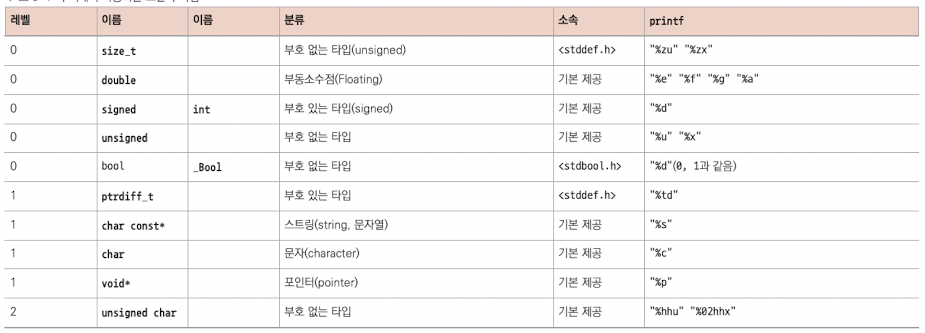

# 들어가며

여러모로 C 언어는 제약이 없는 편이다. programmer가 원한다면 자폭에 가까운 일도 실행할 수 있다. 하지만 이 말은 원하지 않았는데 이런 일이 발생할 수도 있다는 뜻이다.

따라서 C에 익숙해지기 전까지는 몇 가지 제약에 따르는 편이 좋다. 우선 제일 위험한 구문은 바로 **cast**(타입 변환)이다. 배울 과정에서 몇 가지를 먼저 소개한다.

1. **type modifier**(타입 수정자)와 **type qualifier**(타입 한정자)는 왼쪽에 binding된다.

> 단어 그대로 type을 '수정'하기 위한 modifier와, type을 '한정'하기 위한 qualifier이다. 

> logic에서의 quantifier(한정자)와 단어가 다르다.( $\forall$ , $\exists$ )

identifier를 type과 시각적으로 구분하기 위해서 일반적으로 다음과 같이 작성한다.

```c
char* name;
```

> [char[]와 char*의 차이](https://ddongwon.tistory.com/2): char s1[100] = "hello"로 initialization을 하면, h, e, l, l, o, \0의 6개를 제외한 나머지 94칸은 낭비된다. 하지만 char* s2 = "hello"로 initialzation을 하면, 이 hello라는 문자열이 저장된 memory의 base point의 address가 저장된다.

- char*: type

- name: identifier

여기에 qualifier를 추가해 보자. qualifier를 적을 때는 왼쪽 binding을 적용하여 다음과 같이 표기한다.

```c
char const* const path_name;
```

- 첫 번째 const qualifier 는 왼쪽의 char에 적용되며, *를 붙여서 pointer로 만들었다.

- 두 번째 const qualifier도 왼쪽으로 binding된다.

<br/>

2. 연달아 declaration하지 않는다.

type declaration이 연달아 나오면 binding 과정이 모호해진다.

```c
unsigned const*const a, b;
```

- b의 type은 unsigned const이다.

- 다시 말해 첫 번째 const는 type에 적용되고, 두 번째 const는 a declaration에 적용된다.

<br/>

3. pointer parameter(포인터 매개변수)를 array로 표기한다.

null이 될 수 없는 pointer는 항상 array로 표기하는 것이 좋다. 아래는 그 예시다.

```c
/* parameter가 null이 될 수 없음을 강조한다. */
size_t strlen(char const string[static 1]);
int main(int argc, char* argv[argc+1]);
```

> int argc: argument count(인자 개수). main function에 전달되는 data 개수를 의미한다. (argv[argc+1]로 표기한 이유는 index가 0부터 시작하기 때문이다.)

> int argv: argument vector(인자 벡터). main function에 전달되는 실제적인 data. 첫 번째 문자열은 항상 program의 실행경로이다.(예를 들어 argv[0]을 출력하면 /Users/erectbranch/C/test.c/Debug/test.c.exe를 출력한다.)

> 따라서 사용자가 만약 다른 입력을 추가로 준다면 그 data는 argv[1]부터 들어가게 될 것이다. 또한 argc의 개수만큼 입력 조건을 맞추지 못한다면 Exception을 발생시킬 것이다.

- 첫 번째 문장은 strlen이 유효한(null이 아닌) pointer를 받고, string element를 최소한 한 개 이상 받는다는 것을 강조했다.

- 두 번째 문장은 main이 char pointer로 구성된 array를 받는다는 것을 표현한다.(이 array는 program 이름과, program argument(argc-1)와 array의 끝을 나타내는 null pointer로 구성된다.)

```c
/* 다음과 같이 declaration할 수도 있다. */
size_t strlen(const char *string);
int main(int argc, char **argv);
```

<br/>

4. function pointer parameter(함수 포인터 매개변수)는 function처럼 표기한다.

function pointer도 array와 마찬가지로 null이 될 수 없을 때마다 이렇게 표현한다.

```c
/* handler란 parameter가 null이 될 수 없음을 강조한 표현 */
int atexit(void handler(void));
/* 같은 내용을 다르게 declaration한 문장) */
int atexit(void (*handler)(void));
```

- 첫 번째 atexit declaration은 handler란 이름의 function을 argument로 받으며, null function pointer는 허용하지 않는다고 강조한 것이다.

- 참고로 array parameter가 object pointer로 변환되듯이, function parameter인 hander는 function pointer로 변환된다.

<br/>

5. variable declaration statement는 그 variable를 처음 사용하는 지점과 최대한 가까이 둔다.

초보자는 가급적이면 declaration과 initialization을 함께 실행할 수 있는 definition 기능을 사용하는 것이 좋다.

<br/>

6. code block은 **prefix notation**(전위 표기법)을 따르라.

- {는 항상 첫 문장이나 declaration과 같은 줄에 적는다.

- block 안에 나오는 code는 한 단계 들여 쓴다.

- 마지막 }는 새 line에 작성하고, 시작 block과 같은 들여쓰기를 적용한다.

- } 뒤에 이어지는 block 문장은 같은 줄에 쓴다.

이 표기법을 준수한 예시는 다음과 같다.

```c
int main(int argc, char* argv[argc+1]) {
    puts("Hello world");
    if (argc > 1) {
        while (true) {
            puts("절대 멈추지 않는 프로그램은 존재한다.");
        }
    } else {
        do {
            puts("하지만 이 프로그램은 멈춘다.");
        } while (false);
    }
    return EXIT_SUCCESS;
}
```

---

# 3 제어

c 언어는 if, for, do, while, switch라는 다섯 가지 **conditional control statement**(조건부 제어문)을 제공한다.

if는 boolean 표현식의 값을 기준으로 **conditional execution**(조건부 실행) 기능을 제공한다. for, do, while은 **iteration**이고, switch는 정수 값을 기준으로 **multiple selection**(다중 선택) 기능을 제공한다.

---

## 3.1 conditional execution

```c
if (i > 25) {
    j = i - 25;
}
```

- i > 25: **controlling expression**(제어 표현식)

- {...}: **dependent block**(의존 블록)

for문과 다른 점은, () 안에 controlling expression만 있고, 그 값에 따라 dependent statement 혹은 dependent block을 한 번 실행시킬지, 아니면 그냥 건너뛸지를 결정한다.

```c
if (i > 25) {
    j = i - 25;
} else {
    j = 1;
}
```

이번에는 if의 condition을 만족하지 못할 때 실행되는 dependent statement 혹은 dependent block이 하나 더 달려 있다.

이런 식으로 if (...) ... else ..를 **selection statement**(선택문)이라고 부른다. 이 statement는 (...) 안에 담긴 value에 따라 두 가지 **code path**(코드 경로) 중  하나를 선택한다.

```c
for (size_t i = 0; i < 5; ++i) {
    if (i) {
        printf("element %zu is %g, \tits square is %g\n",
            i,
            A[i],
            A[i]*A[i]);
    }
}
```

위 코드는 controlling expression으로 i 단 하나만 주었다. 이런 경우에는 i의 value가 0이 아닐 때만 dependent block이 실행된다.

> 0은 논리값 **false**(거짓)을 의미한다.

> 0이 아닌 모든 값은 논리값 **true**(참)을 의미한다.

> 따라서 if (i != 0)를 간결하게 표현한 것과 마찬가지다.

bool type을 이용할 수도 있는데, bool type이 가질 수 있는 값은 false나 true뿐이다. 내부적으로 false가 0, true가 1과 동일하지만, <U>조건을 표현한다면 숫자보다는 false/true로 표현</U>하는 것이 좋다.

```c
bool b = ...;
//...
if ((b != false) == true) {
    //...
}
```

위 예제는 비교문에 군더더기가 많다. bool type을 이용한 controlling expression으로는 곧바로 진리값만 쓰는 것이 좋다.

```c
bool b = ...;
// ...
if (b) {
    //...
}
```

> **일반적으로 0, false, true'끼리' 비교하는 표현은 쓰지 않는다.** 진리값을 곧바로 사용하라.

> **스칼라 값은 모두 진리값이 될 수 있다.**

여기서 말하는 scalar type은 size_t, bool, int와 같은 숫자 type만이 아니라, <U>pointer type도 포함된다.</U>



---

## 3.2 iteration

for문의 기본 형태는 다음과 같다.

> for (절1; 조건2; 표현식3) statement or block

- 절1: 흔히 assignment(대입) 표현식이나 variable definition을 적는다.(즉, iteration domaion의 초깃값을 지정하는 역할을 한다.) 

- 조건2: iteration을 계속할지 검사한다. 

- 표현식3: 절1에 나온 iteration variable(반복 변수)의 value를 update한다.

예제를 살펴보자.

```c
for (size_t i = 10; i; --i) {
    something(i);
}
```

이 iteration에서는 i를 10부터 1까지 거꾸로 센다.(경계값 포함) 조건문은 단순히 variable i를 평가하지만(값을 가져오기만) 한다. 값이 0인지 비교하는 문장을 굳이 적지 않은 이유는, <U>i value가 0이 되면 조건은 false가 돼서 loop가 멈추기 때문이다.</U>

다음 예제도 보자.

```c
for (size_t i = 9; i <= 9; --i) {
    somethine_else(i);
}
```

이 for문은 끝없이 iteration 되는 것으로 보이지만, 실제로는 9부터 0까지 거꾸로 센다. C 언어에서 <U>size_t type으로 된 숫자(**크기와 관련된 숫자**)는 절대 음수가 되지 않기 때문이다.</U>

> 이 variable 이름이 i로 같은 두 for문을 같은 program에서 나란히 둬도, <U>scope가 다르기 때문에 서로 영향을 미치지 않고 실행</U>할 수 있다.

while과 do iteration의 기본 형태는 다음과 같다.

- while (조건) statement or block

- do statement or block while(조건)

아래는 while문의 대표적인 예시다. Heron approximation(헤론의 근사 공식)을 이용하여 숫자 $x$ 의 역수인 $1 \over x$ 를 계산한다.

```c
#include <tgmath.h>

double const eps = 1E-9;    // 원하는 precision
//...
double const a = 34.0;
double x = 0.5;
while (fabs(1.0 - a*x) >= epx) {    // 기준에 근접할 때까지 반복한다.
    // Heron approximation
    x *= (2.0 - a*x);
}
```

- fabs(): double type의 절댓값을 계산하는 매크로(tgmath.h header에 정의되어 있다.)

이 iteration은 지정한 조건이 true가 될 때까지 반복한다. do loop도 거의 비슷하지만, 우선 dependent block을 실행하고 나서 조건을 검사한다는 점이 다르다.(**즉, 최소한 한 번은 실행된다.**)

```c
do {
    x *= (2.0 - a*x);
} while (fabs(1.0 - a*x) >= eps);
```

> while iteration과 다르게 do는 항상 while(조건) 뒤에 ;가 붙는다. 이런 특성이 여러 문장을 중첩할 때 굉장히 유용하게 만든다.

이런 iteration 안에서 **break**와 **continue** statement를 함께 사용하면 훨씬 다양하게 제어할 수 있다.

- break: **종료 조건을 다시 평가하지 않고 종료**한다. <U>dependent block 안에서도, break문 뒤에 나온 부분은 실행하지 않고 loop를 종료</U>한다.

```c
while (true) {
    double prod = a*x;
    if (fabs(1.0 - prod) < eps) { // 기준에 충분히 근접하면 멈춘다.
        break;
    }
    x *= (2.0 - prod);    // Heron approximation
}
```

그런데 적용하고 보니 while의 조건 자체가 할 일이 없어진다. 이를 for문으로 작성할 수 있다. 보통 관용적으로 다음과 같이 쓴다.

```c
for (;;) {
    double prod = a*x;
    if (fabs(1.0 - prod) < eps) {    // 기준에 충분히 근접하면 멈춘다.
         break;
    }
    x *= (2.0 - prod);
}
```

여기서 <U>for(;;)는 while(true)와 같다.</U> for의 controlling expression(제어 표현식, ;;의 가운데 부분)을 생략하면 '**always true**'로 처리된다.

> 특별한 이유나 목적이 있어서가 아니라 관례로 자리 잡아서 그렇다.

- continue: **dependent block에서 이 문장 뒤의 부분은 실행되지 않는다.** <U>continue 뒤에 나온 부분은 현재의 iteration 회차에서 실행되지 않고, 다음 회차로 넘어간다.</U> 이후 조건을 검사한 다음 true면 dependent block의 처음부터 실행을 이어간다.

```c
for (size_t i = 0; i < max_iterations; ++i) {
    if (x > 1.0) {    // 올바른 방향인지 확인한다.
        x = 1.0/x;
        continue;
    }
    double prod = a*x;
    if (fabs(1.0 - prod) < eps) {    // 기준에 근접하면 멈춘다
        break;
    }
    x *= (2.0 - prod);
}
```

다음 예제로 fabs 매크로(double type의 절댓값 연산)를 이용하지 않고 위 예시의 알고리즘을 구현한 것이다.

### <span style='background-color: #393E46; color: #F7F7F7'>&nbsp;&nbsp;&nbsp;📝 예제 3-1: 곱의 역원 계산&nbsp;&nbsp;&nbsp;</span>

목표는 Heron approximation을 이용해서 숫자 $x$ 의 역수인 $1 \over x$ 를 구하는 것이다.

Heron approximation이란 임의의 수의 제곱근에 빠르게 수렴하는 수열을 만들어 근삿값을 구하는 방법이다.(이차방정식의 근사해를 구하는 방법과 유사하다.)

양의 실수 $a$ 의 제곱근 $\sqrt{a}$ 의 근삿값을 다음과 같은 과정으로 구할 수 있다.

1. 임의의 양의 실수 $x_0$ 을 택한다. (이 값이 $\sqrt{a}$ 와 가까울수록 더 빨리 근삿값을 구할 수 있다.)

2. $x_{n+1} = {1 \over 2}(x_n + {a \over x_n}) = {{{x_n}^2 + a} \over {2x_n}}$

3. 원하는 정밀도에 이르기까지 2의 과정을 반복한다.

예를 들어 $\sqrt{2}$ 의 근삿값을 구하는 과정은 다음과 같다.

$x_1 = {{3} \over {2}} = 1.5$

$x_2 = {{17} \over {12}} = 1.4166666...$

$x_3 = {{577} \over {408}} \approx 1.4142156882... $

...

$x_5$ 는 $\sqrt{2}$ 의 참값과 소수점 아래 23자리까지 일치한다.

### <span style='background-color: #C2B2B2; color: #F7F7F7'>&nbsp;&nbsp;&nbsp;🔍 풀이&nbsp;&nbsp;&nbsp;</span>

관심 대상 숫자는 a, 현재 추정값은 x로 표기한다. 비교할 특정한 고정 숫자값은 다음과 같이 정의한다. 

- $1 - 2^{-24}$ 를 eps1m24로 정의한다.

- $1 + 2^{-24}$ 를 eps1p24로 정의한다.

```c
#include <stdlib.h>
#include <stdio.h>

static double const eps1m01 = 1.0 - 0x1P-01;
static double const eps1p01 = 1.0 + 0x1P-01;
static double const eps1m24 = 1.0 - 0x1P-24;
static double const eps1p24 = 1.0 + 0x1P-24;

int main(int argc, char* argv[argc+1]) {
    for (int i = 1; i < argc; ++1) {
        double const a = strtod(argv[i], 0);    // arg -> double
        double x = 1.0;
        for (;;) {
            double x = 1.0;
            for (;;) {
                double prod = a*x;
                if (prod < eps1m01) {
                    x *= 2.0;
                } else if (eps1p01 < prod) {
                    x *= 0.5;
                } else {
                    break;
                }
            }
            for (;;) {    // Heron approximation
                double prod = a*x;
                if ((prod < eps1m24) || (eps1p24 < prod)) {
                    x *= (2.0 - prod);
                } else {
                    break;
                }
            }
            printf("heron: a=%.5e,\tx=%.5e,\ta*x=%.12f\n",
                    a, x, a*x);
        }
        return EXIT_SUCCESS;
    }
}
```

---

## 3.3 다중 선택

마지막으로 소개할 control statement는 switch문이다. 주로 if-else문이 너무 길어서 코드가 복잡해질 때 사용한다.

우선 아래 if-else문을 보자.

```c
if (arr =='m') {
    puts("this is a magpie");        // 까치
} else if (arg == 'r') {
    puts("this is a raven");         // 까마귀
} else if (arg == 'j') {
    puts("this is a jay");           // 어치
} else if (arg == 'c') {
    puts("this is a chough");        // 붉은 다리 까마귀
} else {
    puts("this is an unknown corvid");    // 알 수 없는 까마귀과
}
```

- puts: argument로 전달한 string 한 줄을 화면에 출력한다.(stdio.h에 정의되어 있다.)

이를 switch문으로 쓰면 다음과 같다.

```c
switch (arg) {
    case 'm': puts("this is a magpie");
              break;
    case 'r': puts("this is a raven");
              break;
    case 'j': puts("this is a jay");
              break;
    case 'c': puts("this is a magpie");
              break;
    default: puts("this is an unknown corvid");    //fallback case
}
```

- default: **fallback** case. 조건과 일치하는 value가 없을 때 선택된다.

case와 default label은 **jump target**(점프 타깃) 역할을 한다. 표현식의 값과 일치하는 label의 문장을 실행한다. break문을 만나면 그 문장이 속한 switch문이 종료되고, 이후 switch 다음 문장으로 넘어간다.

switch문은 if-else보다 구조가 좀 더 유연하지만 다음과 같은 제약 사항을 갖는다.

- case value는 반드시 **정수 타입의 상수 표현식**으로 지정한다.

> 위 예제에서도 변수 arg는 switch 키워드 옆에만 적을 수 있고, case에서는 사용할 수 없다.

- case label은 변수 정의 범위를 벗어나면 안 된다.

---