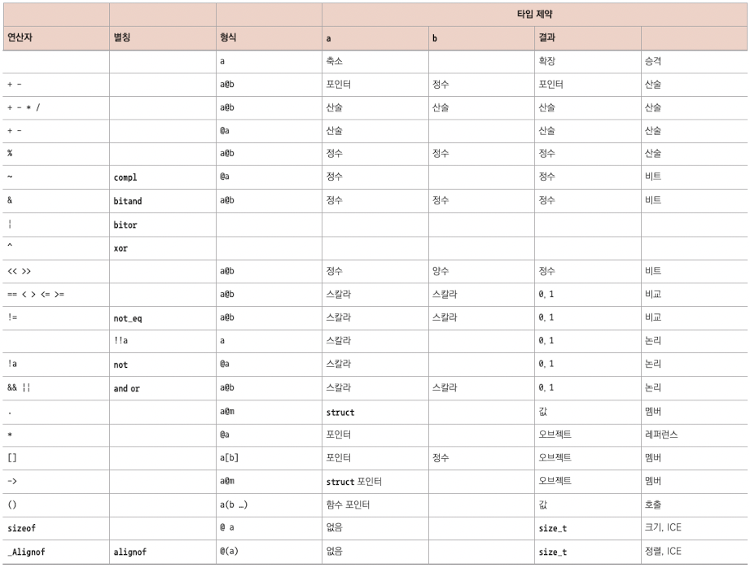
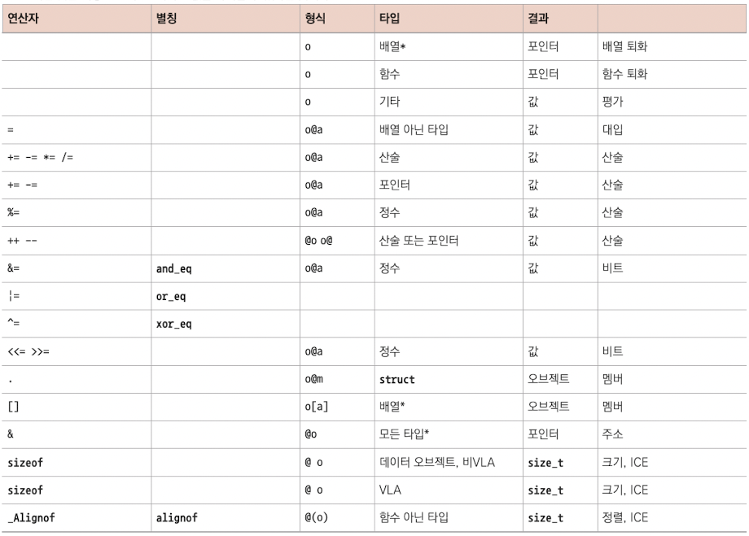
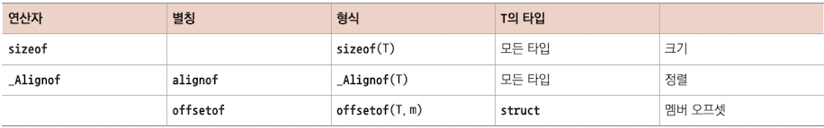
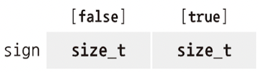
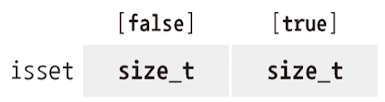

# 4 계산 표현하기

앞으로 종종 사용할 object의 type인 **size_t**는 <U>'size(크기)'를 나타낸다.</U> 따라서 음수가 될 수 없고 0부터 시작한다. 물론 자연수 전체를 직접 표현할 수는 없고, 무한에 가까운 값은 적절히 approximation한다. size_t로 표현할 수 있는 값의 상한은 **SIZE_MAX**로 표현한다.

정리하면 size_t type은 [0, SIZE_MAX] 구간의 값을 의미한다. 플랫폼에 따라 다음 값 중 하나로 정해진다.

- $2^{16} - 1 = 65535$

- $2^{32} - 1 = 4294967295$

- $2^{64} - 1$

> stdint.h 헤더를 사용하면 SIZE_MAX 값을 알 수 있다.

C 언어에서는 size_t처럼 '음이 될 수 없는 숫자'를 **unsigned integer type**라고 부른다. 그리고 이런 구분은 **operator**(연산자)를 적용할 때 중요하다.



- @는 operator, a와 b는 operand에 해당한다.



- @는 operator, o는 object, a는 operand에 해당한다.

- '타입' 열에서 *로 표시한 것은, 해당 object o의 address를 가져올 수 있다는 의미이다.



- 이 operator는 size_t로 된 integer constant(**ICE**)를 return한다.

---

## 4.1 산술

+, -, *와 같은 **arithmetic operator**(산술 연산자)는 설명할 것도 없다.

```c
size_t a = 45;
size_t b = 7;
size_t c = (a - b)*2;    // = 76
size_t d = a - b*2;      // = 31
```

+와 -는 단항 operator로 사용할 수 있다. -b는 b의 음수값을 나타낸다. 이런 점 덕분에 unsigned integer로도 얼마든지 - operator를 이용해 음수로 만들거나 뺄셈을 적용할 수 있다.

> 전문 용어로 말하자면 '- operator는 unsigned type에 **well-defined**(잘 정의되어 있다.)고 표현한다.(범위만 [0, SIZE_MAX]를 벗어나지 않으면 된다.)

```c
size_t c = (+a + -b)*2;
```

하지만 계산 결과가 [0, SIZE_MAX]를 벗어날 때, 즉 size_t로 **represenatble**하지 않을 때, **overflow**(오버플로)가 발생했다고 말한다.

---

### 4.1.2 나눗셈과 나머지

unsigned type이라면 a == (a/b)*b + (a%b)가 성립한다. % 연산자를 응용한 대표적인 예시로 시간이 있는데, 12시간 또는 24시간으로 표현하는 시계에서 시간 차를 % 연산자를 사용할 수 있다.(예를 들어 a % 12)

또한 이 두 operator를 사용한다면 두 번째 operand 자리(a@b에서 b의 자리)에 0이 위치해서는 안 된다. 이 경우 overflow가 발생한다. 이렇게 overflow가 발생 시 해당 type의 시작점으로 되돌아간다.

> 즉, size_t라면 [0, SIZE_MAX]이므로 0으로 되돌아가는 것이다.

이런 이유 때문에 size_t에 산술 연산을 수행할 때는, 암묵적으로 %(SIZE_MAX+1)이 적용된다. 또한 결과로 - 연산자가 unsigned type에 적용될 때는 이렇게 시작점으로 되돌아가는 현상이 발생한다.

예를 들어 size_t에서 -1이란 값은 SIZE_MAX와 같다. 따라서 a에 -1을 더한 결과는 a + SIZE_MAX가 된다.

---

## 4.2 object를 수정하는 연산자

a = 42와 같은 **assignment**(대입) operator도 중요하다. 이 operator는 대칭적이지 않다. 다시 말해 왼쪽(lvalue)은 object인데 오른쪽(rvalue)은 value이다. 

+=, -=, *=, /=. %=라는 연산자처럼 arithmetic operator와 assignment operator를 하나로 합쳐서 간결하게 표현할 수 있다.

object를 수정하는 또 다른 operator인 **increment operator**(증가 연산자) ++와 **decrement operator**(감소 연산자) --도 있다.

그러나 여러 object를 수정하는 statement를 하나로 합치면 코드가 난해해진다.(a = b = c += ++d;처럼) 이 코드처럼 표현식을 처리하는 과정에서 object가 변하는 현상을 **side effect**(부작용)이라고 부른다.

> 한 statement 안에서 한 object를 여러 번 수정하지 않는다.

---

## 4.3 불 연산

특정 condition 만족 여부에 따라 0이나 1의 값을 내는 operator들이 있다. 크게 **comparison operator**(비교 연산자)와 **logic operator**(논리 연산자)로 구분할 수 있다.

### 4.3.1 comparison operator

==, !=, <, > 등이 comparision operator(비교 연산자)에 해당한다. 이들은 false나 true value를 return한다.

> <U>true나 false는 어디까지나 1과 0을 다르게 표현한 단어일 뿐이므로, arithmatic operation나 array index로도 사용할 수 있다.</U>

아래 예시는 array element 중에서 sign[false]는 largeA에 있는 값 중에서 1.0보다 같거나 큰 것의 개수를 기록하고, sign[true]는 1.0보다 작은 값의 개수를 기록한다.



```c
double largeA[N] = { 0 };
// ...
/* largeA를 채운다. */

size_t sign[2] = { 0, 0 };
for (size_t i = 0; i < N; ++i) {
    sign[(largeA[i] < 1.0)] += 1;    // largeA[i] < 1.0이면 true, 아니면 false
}
```

> not_eq라는 identifier도 있지만, 지금은 거의 사용하지 않는다. !=를 제대로 표현하지 못하는 컴퓨터가 있던 시절에 나왔기 때문이다.(iso646.h header를 include해야 한다.)

---

### 4.3.2 논리 연산

- ! operator(not operator): 논리 부정

- && operator(and operator): 논리곱

- || operator(or operator): 논리합

이런 logic operator도 마찬가지로 false나 true value를 return한다. 따라서 arithmatic operation나 array index로도 사용할 수 있다.

```c
double largeA[N] = { 0 };
//...
/* largeA를 채운다. */

size_t isset[2] = { 0, 0 };
for (size_t i = 0; i < N; ++i) {
    isset[!!largeA[i]] += 1;
}
```

- largeA[i] 값이 반드시 진리값으로 평가되도록 강조하기 위해 **! 연산자를 두 번 사용**했다.

위 예제는 isset[0]에 0.0과 같은 값의 개수, isset[1]에 그렇지 않은 값의 개수가 담기게 된다.



> &&와 || 연산자는 **short-circuit evaluation**(단락 평가)가 적용된다. 두 번째 operand의 평가는 상황에 따라 생략되기도 한다.

0으로 절대 나누지 않도록 하려면 다음과 같이 식을 나타낼 수도 있다.

```c
if (b != 0 && ((a/b) > 1)) {
    ++x;
}
```

혹은 다음과 같이 나타낼 수도 있다.

```c
if (b) {
    if (a/b > 1) {
        ++x;
    }
}
```

---

## 4.4 ternary operator

**ternary operator**(삼항 연산자)는 if문처럼 두 가지 갈래 중 조건에 맞는 것을 골라서 return하는 표현식이다.

```c
size_t size_min(size_t a, size_t b) {
    return (a < b) ? a : b;
}
```

&&와 || operand와 마찬가지로 두 번째와 세 번째 operand는 꼭 필요할 때만 평가된다. 

---

## 4.5 평가 순서

&&, ||, ?:와 , operator는 항상 첫 번째 operand부터 평가한다.

> comma operand는 operand를 순서대로 평가해서 오른쪽 operand에 결과값을 담는 operator다. 예를 들어 (f(a), f(b))는 f(a)를 평가한 뒤에 f(b)를 평가하고, 그 결과는 f(b) 값이 된다. 하지만 사용하지 않을 것을 권장한다.

대부분의 operator는 operand의 평가 순서가 따로 정해져 있지 않다. 따라서 언제나 arithmetic 표현식에서 평가 순서에 의존하지 않아야 한다.

---