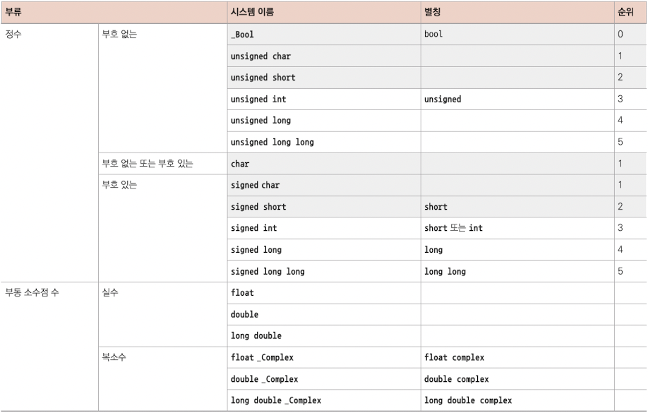
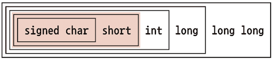
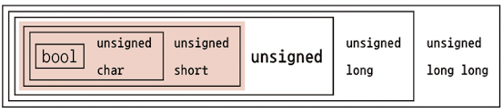
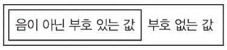
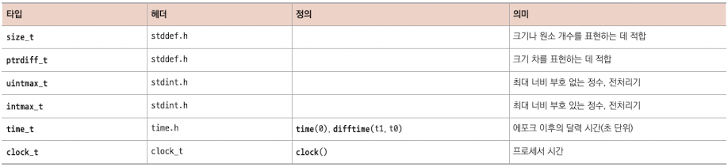

# 5 값과 데이터

C program은 표현 방식보다는 value를 중심으로 처리한다. value와 표현 사이의 변환 작업은 compiler가 처리해 주므로, 특정한 value에 대한 표현 자체는 크게 중요하지 않은 경우가 많다.

C 언어는 program이 의도한 ideal한 상황을 abstract state machine(추상 상태 기계)라고 표현한다. 다시 말해 작성한 program이 실제로 구동되는 플랫폼과 상관없이 수행하고자 하는 바를 표현하는 것이다.

---

## 5.1 abstract state machine

C program은 값을 처리하는 기계라고 볼 수 있다. program에서 사용하는 variable은 실행 시점마다 특정한 value를 지니는데, 이 값은 (복합 표현식의 최종 표현식으로 이어지는) 중간값일 수도 있다.

```c
double x = 5.0;
double y = 3.0;
// ...
x = (x * 1.5) - y;
printf("x is \%g\n", x);
```

- x와 y는 초깃값이 각각 5.0, 3.0이다.

- (x * 1.5) - y의 실행 결과로 x의 평가 결과는 4.5가 된다.

- 따라서 printf가 위치한 statement는 다음과 같이 실행된다.

  - printf("x is \%g\n", 4.5);

이렇게 program이 연산하는 과정, 결과를 항상 **observable**(관측이 가능)한 것은 아니다. **addressable memory**(주소 기반 메모리)에 저장하거나 출력 장치에 쓸 때만 볼 수 있다. 

> 예제에서 printf는 x를 평가해 그 결과를 string으로 표현하여 터미널에 출력하므로, 앞 줄에서 수행한 결과를 어느 정도 observable하다. 하지만 그 앞에 있는 부분의 곱셈, 뺄셈과 같은 중간 결과는 그렇지 않았다.(그 값을 담을 variable을 따로 정의하지 않았기 때문이다.)

- compiler의 **optimization**

C compiler는 **optimization**(최적화) 과정을 수행할 때, 최종 결과의 정확성을 해치지 않는다면, 겉으로 드러나지 않는 계산 과정을 얼마든지 축약할 수 있다. 예제의 경우 다음과 같이 된다.

```c
printf("x is 4.5\n");
```

> 다시 말해 앞에 나온 계산 과정이 모두 compile 시간에 처리되고, 실행 파일에는 고정된 string 하나를 출력하게 만드는 것이다. 앞서 variable definition을 비롯한 다른 부분이 모두 제거된다.

또 다른 optimization 방법은 x를 뒤에서 다시 사용하는 경우에 적용된다. 이 경우 compiler는 다음과 같이 처리할 수 있다.

```c
double x = 4.5;
printf("x is 4.5\n");
/* 또는 순서를 바꾸기도 한다. 
printf("x is 4.5\n");
double x = 4.5;
*/
```

결국 오류 없이 optimization할 때 중요한 단 한 가지 사항은, C compiler가 **observable state**(관측 가능한 상태)를 재현하는 실행 파일을 만들어내는지 여부다. 그리고 이런 state가 변경되는 전반적인 메커니즘을 **abstract state machine**(추상 상태 기계)라고 부른다.

> **abstract**(추상)이란 단어는 다양한 플랫폼에서 각자의 능력과 필요에 맞게 구현할 수 있는 메커니즘을 의미한다.

이런 메커니즘을 알기 위해 우선 살펴봐야 할 개념은 다음과 같다.

- 현재 state를 표현하는 **value**(값)

- 그 state가 표현하는 대상인 **type**(타입)

- state를 구분하는 방식인 **representation**(표현)

---

### 5.1.1 value

C에서 value는 program의 구체적인 구현 방식이나, program 실행 중에 표현되는 방식과는 독립적인 abtract한 개체다.

예를 들어 0이란 값은 <U>모든 C 플랫폼에서 똑같은 효과를 내야 한다.</U> 0을 x라는 값과 더하면 그 결과는 여전히 x여야 하고, control statement에 나온 표현식에 결과가 0이면 항상 false에 해당하는 control statement로 분기해야 한다.

value는 모두 숫자거나 숫자로 변환된다. 즉, 화면에 출력하는 문자나 텍스트뿐만 아니라 진리값, 측정값, 관계식 등도 똑같이 적용된다. <U>이런 숫자는 작성한 program code나 구현 방식과 별개로 수학적인 개체로 취급된다.</U>

program execution(프로그램 실행)에서 **data**란 <U>어떤 시점의 모든 object가 갖는 값 전체를 의미한다.</U> program execution state는 다음과 같은 요소로 구성된다.

- execution file

- 현재 실행 지점

- data

- 외부 개입(사용자 IO 등)

외부 개입을 제외하면, program을 동일한 실행 지점에서 동일한 data로 실행했을 때 항상 똑같은 결과가 나와야 한다. 하지만 C program을 다양한 시스템에 포팅(이식)하기 위해서는 이 조건만으로는 부족하다. 계산 결과가 (플랫폼에 종속적인) execution file 단위가 아니라, program specification(프로그램 규격)에만 종속되야 바람직할 것이다. 

> 이런 플랫폼 독립성을 실현하기 위해 중요한 것이 바로 type이다.

---

### 5.1.2 type

C에서 type은 값에 적용되는 속성이다. 예제에서 본 size_t, double, bool 등이 type에 해당한다.

- value마다 type을 가지며, compile 시간에 따라 결정된다.

- value마다 적용할 수 있는 연산은 type에 따라 결정된다.

- value의 type에 따라 연산의 결과가 달라진다.

---

### 5.1.3 binary representation과 abstact state machine

하지만 아쉽게도 C 표준에는 type의 종류에 따른 연산 결과가 모든 컴퓨터 플랫폼에 완벽하게 정의되어 있지 않다. 예를 들어 signed type(부호가 있는 타입)의 부호 표현 방식이나, double type의 floating point 연산에 적용할 precision이 해당한다.

이런 표현에 C 언어 규격은 다음과 같이 두 가지 요소만으로 연산 결과를 사전에 추론할 수 있어야 한다고만 정의하고 있다.

- operand의 value

- 특정한 플랫폼을 표현하는 characteristic value(고유값)

예를 들어 size_t type의 연산은 operand뿐만 아니라 SIZE_MAX 값을 확인해야만 확실히 결정된다. 이렇게 특정 플랫폼에서 type의 value를 표현하는 것을 **binary representation**(바이너리 표현)이라고 한다.

C 라이브러리 헤더에서 이렇게 필요한 정보(예제의 SIZE_MAX 등)를 이름 있는 값, 연산자, 함수 호출 등을 통해 제공하게 된다.

이러한 binary representation도 역시 일종의 모델이다. 컴퓨터의 memory나 disk 또는 영구 저장 장치에 값이 저장되는 방식을 구체적으로 지정하지 않는다는 점에서 abstract representation이라고 할 수 있다. 

> 참고로 저장 방식을 구체적으로 지정하는 표현을 **object representation**(오브젝트 표현)이라 한다. 

> main memory에 있는 object 값을 해킹하거나, 플랫폼 모델이 상이한 컴퓨터끼리 통신하지 않는 한 object representation에 대해 크게 신경 쓸 필요는 없다.

결국 모든 연산은 value와 type과 program에 지정된 binary representation에 따라 결정된다. program text는 abstract state machine를 표현하며, 이에 따라 program은 한 state에서 다른 state로 전이된다.

---

### 5.1.4 optimization

abstract state machine에 명시된 내용을 구체적으로 실행하는 방식은 compiler 제작자의 재량으로 결정된다. 최신 C compiler는 좀 더 observable한 state를 벗어나지 않는 범위에서 code를 최대한 짧게 만든다. 아래는 그 예시다.

```c
x += 5;
/* x를 건들이지 않는 다른 작업을 수행한다. */
x += 7;
```

이 코드를 다음과 같이 처리하는 compiler가 많다.

```c
/* x를 건들이지 않는 다른 작업을 수행한다. */
x += 12;
```

혹은

```c
x += 12;
/* x를 건들이지 않는 다른 작업을 수행한다 */
```

이처럼 결과의 차이점이 겉으로 들어나지 않는 범위에서 얼마든지 실행 순서를 변경한다. 중간에 x의 중간값을 출력하지 않는 한, 혹은 그 중간값을 연산에서 사용하지 않는 한 compiler는 얼마든지 실행 순서를 바꾼다.

하지만 몇몇 program을 중단시킬 수 있는 연산에 한해서는 이런 최적화를 적용할 수 없다. 특히 이는 x의 type에 크게 영향을 받는다. x의 현재 값이 상한에 가깝다면 x += 7 같은 간단한 연산에서도 **overflow**가 발생할 수 있다.

> 예를 들어 size_t type은 [0, SIZE_MAX] 구간의 값만 표현이 가능했고, 이를 넘어가는 경우 overflow가 발생했다.

overflow는 type마다 처리 방식이 다르다. unsigned type에서 발생하는 overflow는 쉽게 처리가 가능하다. 하지만 signed와 같은 부호가 있는 정수 type이나, double과 같은 floating point type에서 발생하는 overflow는 **exception**(에외)가 발생하여 program이 중단될 수 있으므로, 이럴 때는 optimization을 적용하면 안 된다.

결국 이런 성격 때문에 <U>optimization 수준은 type에 따라 결정된다.</U>

---

## 5.2 basic type

C는 다양한 basic type(기본 타입)을 제공하고, 이를 토대로 **derived type**(파생 타입)을 만들 수 있다.

> 사실 basic type은 다소 복잡하고 문법도 직관적이지 않은 편인데, 특별한 이유라기보다는 역사적인 이유 때문인 경우가 많다.

- first level of specification(1차 규격): signed int, double과 같이 C 언어만의 키워드만을 이용한 규격

- second level of specification(2차 규격): 1차 규격을 토대로 header 파일을 통해 사용하는 size_t나 bool 등

우선 1차 규격을 보자. C에서 value는 기본적으로 모두 숫자였지만, 이런 숫자도 부호 존재 여부나 정수, (실수/복소수) floating point 수 여부 등으로 나눌 수 있다. 이런 type들도 각각 세부 type으로 나뉘며, 각 type마다 허용하는 value의 **precision**(정밀도)도 다르다.



위 표에서 회색으로 표시된 것이 산술 연산에서 직접 쓸 수 없는 type이다. 이를 **narrow type**(좁은 타입)이라고 한다. 이 type을 산술 표현식에서 사용하면 더 넓은 type으로 **promote**(승격)된다.





> 이런 narrow integer type에서 특히 주목할 부분은 char과 bool이다. char는 텍스트로 출력할 수 있는 문자를 나타내는 type이며, bool은 false와 true라는 진리값을 갖는다.(마찬가지로 모두 숫자다.)

> 이때 unsigned narrow type은 unsigned int가 아닌 **signed int로 promote**된다는 점에 주의하라.

또한 signed와 unsigned 값의 포함 관계는 다음과 같다.



예를 들어 signed int의 최댓값은 $2^{31} - 1 = 2,147,483,647$ 이고, unsigned int의 최댓값은 $2^{32} -1 = 4,294,967,295$ 다.

아래는 상황에 따른 type 설정 가이드이다.

0. 목적에 맞는 type 선택을 돕기 위해 compiler의 도움을 받을 수 있다. 가령 특정한 속성을 가진 **size_t**나 **typedef**들이 그렇다.

1. **unsigned** type이 가장 편리하다. 수학의 modulo(모듈로) 연산과 동일한 연산을 지원하기 때문이다.

   - overflow가 발생해도 exception을 발생시키지 않고 optimization도 잘 된다.

2. 음수를 가질 수 없는 작은 quantity(양)은 **unsigned**로 표현한다.

3. 부호를 가질 수 있는 작은 양은 **signed**로 표현한다.

4. 부호를 가질 수 있는 큰 difference(차) 연산에는 **ptrdiff_t**를 사용한다.

   - 0.5나 3.77189E+89와 같은 값에 대해 분수 연산을 시행하려면 floating point type을 사용한다.

5. floating point 연산에는 **double**을 사용한다.

6. complex(복소수) 연산에는 **double complex**를 사용한다.

다른 특별한 종류의 산술 타입은 다음과 같다.



- time_t, clock_t: 시간을 다루는 데 사용한다. 플랫폼마다 두 type의 시간 연산 precision이 다르다.

   - 산술식에 사용할 수 있는 초 단위 시간은 difftime function으로 구한다.

   - clock_t value는 현재 플랫폼의 processor clock cycle 모델을 제공한다.(그래서 초보다 작은 단위를 사용할 때가 많다.) 이런 value를 초 단위로 변환하려면 CLOCKS_PER_SEC를 사용하면 된다.

---

## 5.3 value 지정하기

숫자 상수(literal)를 지정하는 방법이다. 아래는 예시에 해당하는 literal과 설명이다.

- 123: **decimal integer constant**.

- 077: **octal integer constant**. 첫 글자는 0이며 나머지는 0부터 7 사이의 숫자가 위치한다.

  - 에를 들어 077은 decimal로 63이다. 요즘은 거의 사용하지 않는다.

- 0xFFFF: **hexadecimal integer constant**. 0x로 시작하여 0~9, a~f를 조합한 숫자가 위치한다.

   - 예를 들어 0xbeaf는 decimal로 48815이다.

   - 알파벳은 소문자나 대문자 어느 쪽으로 표기해도 상관 없다.

- 1.7E-13: **decimal floating-point constant**. 소수점을 포함한 십진수 표현이다. 지수를 이용한 과학 표기법도 가능하다.

   - mEe라고 쓰면 $m\cdot10^{e}$ 을 의미한다.(지수 m은 정수)

- 0x1.7aP-13: **hexadecimal floating-point constant**. 정확한 표기법을 적용해야 하는 floating point 값을 쉽게 표현할 때 사용한다.

    - 0xhPe라고 쓰면 $h\cdot2^{e}$ 을 의미한다.(h는 16진수 소수나 분수가 들어간다. 지수 2는 10진수로 표기한다.)

- 'a': **integer character constant**. 'a'와 '?'처럼 문자를 ''로 묶어서 표현한다. 그리고 대응되는 정수형 코드로 정해진다.

   - character constant(문자 상수)에서 '\\'는 특별한 의미가 있다. 가령 '\\n'은 줄바꿈 문자를 의미한다.

- "hello": **string literal**. printf나 puts function 등에서 텍스트를 지정하는 데 사용된다.

이 목록에서 string literal을 제외하면 모두 숫자를 지정하는 **numerical constant**(숫자 상수)다.

<U>string literal은 compile 시간에 결정되는 텍스트를 지정할 때 사용된다.</U> chunk 단위로 string literal을 자르는 이런 기능 덕분에, 긴 텍스트를 간편하게 코드에 넣을 수 있다.

```c
puts("first line\n"
     "another line\n"
     "first and "
     "second part of the third line");
```

숫자 리터럴을 사용할 때 몇 가지 규칙을 준수해야 한다.

1. 숫자 리터럴은 절대 음수가 될 수 없다.

다시 말해 -34나 -1.5E-23 같이 적으면, 맨 앞에 있는 부호는 숫자에 포함되지 않는, 그 숫자에 적용되는 **negation**(부정) 연산자가 된다.(지수에 있는 - 부호는 floating point 리터럴에 포함된다.)

<br/>

2. 그러나 **decimal integer constant는 부호를 가질 수 있다.**

가령 표현식에 -1이란 decimal integer constant는 signed한 음수 값을 의미한다.

정수 리터럴의 정확한 type은 **first fit rule**(최초 적합 규칙)에 의해 결정된다.

<br/>

3. decimal interger constant는 세 가지 signed type 중 첫 번째로 적합한 type으로 정해진다.

예시를 보자. 현재 플랫폼에서 signed 값의 최솟값이 $-2^{15} = -32768$ , 최댓값이 $2^{15} - 1 = 32767$ 이라고 하자.

- 상수 32768은 signed 범위를 벗어난다. 따라서 signed long이 되어야 한다.

- 따라서 -32768이란 표현식의 type 역시 signed long이 된다. 다시 말해 이런 플랫폼에서는 signed type의 최솟값을 리터럴 상수로 표현할 수 없다.

<br/>

4. 같은 값이라도 서로 type이 다를 수 있다.

signed type의 범위를 벗어난 값이 unsigned type이 될 수도 있다. 방금 예시에서 16진수 상수 0x7FFF(32767)은 signed type이지만, 16진수 상수인 0x8000(32768)은 범위를 벗어나 unsigned type이 된다.

<br/>

5. 음수 값은 8진수나 16진수 상수로 표현하지 않는다. **오직 10진수 constant로만 표현**한다.

> 사람들이 종종 저지르는 실수가 hexadecimal constant에 signed type을 적용해서 음수 값을 표현하려는 시도다. 예를 들어 int x = 0xFFFFFFFF로 선언해서 binary 표현으로 -1을 만들려고 한다. 하지만 언제나 +4294967295가 항상 -1로 변환되는 것은 아니다. 

| 상수 x | 값 | type | -x의 값 |
| --- | --- | --- | --- |
| 2147483647 | +2147483647 | signed | -2147483647 |
| 2147483648 | +2147483648 | signed long | -2147483648 |
| 4294967295 | +4294967295 | signed long | -4294967295 |
| 0x7FFFFFFF | +2147483647 | signed | -2147483647 |
| 0x80000000 | +2147483648 | unsigned | +2147483648 |
| 0xFFFFFFFF | +4294967295 | unsigned | +1 |
| 1 | +1 | signed | -1 |
| 1U | +1 | unsigned | +4294967295 |

<br/>

6. 정수형 상수를 unsigned type이나, 너비가 최소인 type으로 만들 수 있는데, 상수 값을 나타내는 리터럴 뒤에 U, L, LL 등을 붙이면 된다.

- 예를 들어 1U라고 적으면 값은 1이고 type은 unsigned가 된다.

- 1L은 signed long이 된다.

- 1ULL은 값은 1L과 마찬가지로 1이지만 type은 unsigned long long이 된다.

<br/>

7. 서로 다른 리터럴이 같은 값을 가질 수 있다.

<br/>

8. decimal floating point constant의 실제 값은 리터럴 값과 다를 수 있다.

floating point value는 텍스트로 표현된 근삿값일 뿐이다. binary로 표현할 때 소수점 아래 자리를 버리거나 반올림하기 때문이다. 가령 저자의 머신에서는 상수 0.2의 값은 0.2000000000000000111이므로, 0.2와 0.2000000000000000111의 값이 서로 같다.

<br/>

9. floating point constant는 float를 의미하는 f 또는 F로 initialize하거나, long double을 의미하는 l 또는 L로 initialize할 수 있다.(이렇게 적지 않으면 모두 double type이 된다.)

주의할 점은 같은 리터럴이라도 type에 따라 값이 달라진다는 점이다.

| | float | double | long double |
| --- | --- | --- | --- |
| 리터럴 | 0.2f | 0.2 | 0.2L |
| 값 | 0x1.99999AP-3F | 0x1.999999999999AP-3 | 0xC.CCCCCCCCCCCCCCDP-6 |

<br/>

---

### 5.3.1 complex constant

현재 플랫폼에서 complex를 지원하는지 확인하려면 _\_STDC_NO_COMPLEX_\_를 확인하면 된다. 

그 다음 complex type을 제대로 지원하려면 complex.h header 파일을 include해야 한다. 또한 수학 function을 사용하기 위해 tgmath.h를 include했다면, 이 header도 함께 include된다.

안타깝게도 C 언어에는 complex type constant를 지정하는 literal이 없다. 대신 complex type을 쉽게 다루기 위한 macro 몇 가지만을 제공할 뿐이다.

1. CMPLX macro를 이용한 방법

이 macro는 complex의 실수부와 허수부를 표현하는 floating point 값 두 개로 구성된다. 예를 들어 CMPLX(0.5, 0.5)는 실수부와 허수부를 갖는 double complex 값이다.

> float complex에 대한 CMPLXF와 long double complex에 대한 CMPLXL도 있다.

2. I macro를 이용한 방법

CMPLX macro보다 간단한다. 이 macro는 I*I = -1을 만족하는 float complex 상수 값을 표현한다.

예를 들어 0.5 + 0.5\*I와 같이 적으면 double complex type이 되며, 0.5F + 0.5F\*I라고 적으면 float complex type이 된다.

> I macro처럼 이름이 대문자 하나로 이루어진 macro는, program 전체에서 상수를 표현할 때 주로 사용한다.

> 대신 코드에서 대문자 I를 다른 용도로 사용하면 안 된다.

---

## 5.4 implicit conversion

operand type에 따라 operator 표현식의 type이 결정됐다. 가령 -1은 signed int인 반면, -1U는 unsigned int가 된다.(값이 굉장히 큰 양수가 된다.) 이처럼 - operator가 operand type에 따라 다르게 적용된 것을 볼 수 있다.

> 단항 operator인 -와 +의 type은 promote된 인수 type을 따른다.

이런 operator는 변하더라도 C 언어의 **implicit conversion**(암묵적 변환) 규칙을 따른다. 다음 예시를 보자.

signed int의 최솟값과 최댓값을 -2147483648, 2147483648( $2^{31} -1$ , 32bit signed int의 최댓값 )이라고 가정하자.

```c
double a = 1;           // 문제 없음. type에 맞는 값이다.
signed short b = -1;    // 문제 없음.

signed int c = 0x80000000;  // 위험. 지정된 type을 벗어나는 값
signed int d = -0x80000000; // 위험. 지정된 type을 벗어나는 값

signed int e = -2147483648;    // 문제 없음.

unsigned short g = 0x80000000; // 정보 손실 발생. 0이 된다.
```

- a, b: 아무 문제 없다. 각각의 값이 주어진 type의 범위를 벗어나지 않는다. 따라서 C compiler는 type을 implicit하게 변환할 수 있다.

- c: 0x80000000은 십진수로 2147483648이지만, unsigned int type이므로 signed int의 범위를 벗어난다. 플랫폼에 따라 오른쪽에 나온 값의 bit 패턴을 그대로 재활용할 수도 있고, program이 종료될 수도 있다.

- d: -0x80000000은 -2147483648이어야 하지만, 2147483648이 되어 버린다.

- e: 음의 decimal literal를 사용했으므로 별 문제 없다. 이 값은 signed long type이기 때문에 실제 값도 -2147483648이다. 이 값이 signed int 범위를 벗어나지 않기 때문에 아무 문제 없이 변환된다.

- g: unsigned type에 담기에는 값이 너무 커서 modulo 연산에 따라 변환된다. 특히 여기서 unsigned short의 최갯값이 $2^{16} - 1$ 이라고 가정하면 결과가 0이 된다. 이렇게 **narrowing**(축소 연산)이 적용된 결과가 올바른 값인지 판단하기 어려울 때가 많다.

> narrowing은 가급적 사용하지 않고, 산술식에서 narrow type을 사용하지 않아야 한다.

덧셈과 곱셈처럼 operand가 두 개인 operator에 적용되는 type 규칙은 이보다 훨씬 복잡하다. 두 operand의 type이 서로 다를 수 있기 때문이다.

대체로 혼합 연산에서 한쪽 type의 범위가 다를 경우, 넓은 쪽의 type을 따를 때가 많다.

```c
1 + 0.0           // 문제 없다. double
1 + I             // 문제 없다. complex float
INT_MAX + 0.0F    // precision이 떨어질 수 있다. float
INT_MAX + I       // precision이 떨어질 수 있다. complex float
INT_MAX + 0.0     // 문제 없을 때가 많다. double
```

---