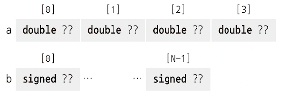
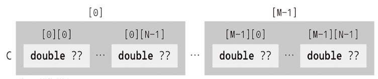
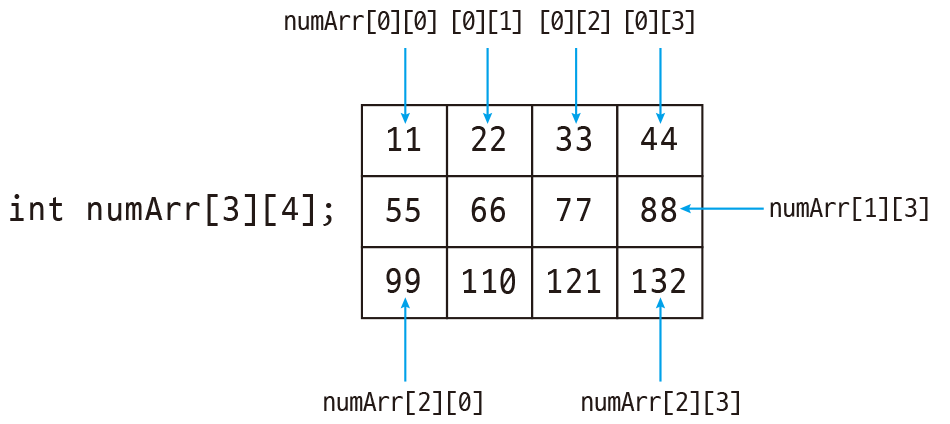
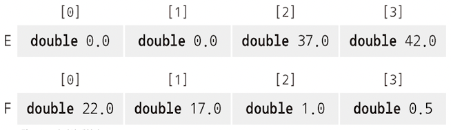
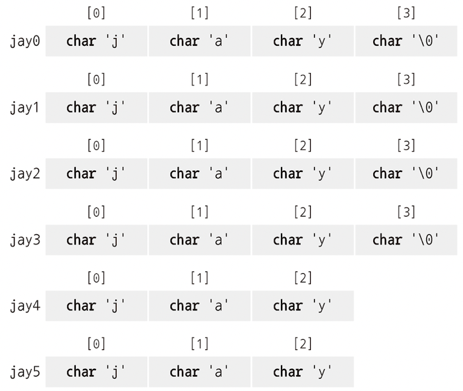
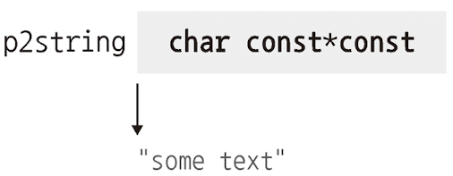
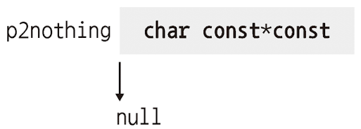
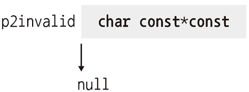

# 6 파생 데이터 타입

파생 데이터 타입으로는 네 가지가 있다. 

- **array**(배열): type이 같은 element를 묶는다.

- **structure**(구조체): type이 다른 element를 묶는다.

이처럼 하나 또는 여러 **instance**(인스턴스, 생성된 object)를 묶기 때문에, 위 두 가지 data type을 **aggregate data type**(묶음형 데이터 타입)이라고 한다.

다음과 같이 더 복잡한 data tpe도 있다.

- **pointer**(포인터): memory에 있는 object를 가리킨다.

- **union**(유니온): 다양한 기본 type을 동일한 memory 위치에 겹쳐서 나열한다.

이외에도 type의 이름을 새로 짓는 typedef가 있다. 이는 새 type을 만드는 앞의 네 가지 type과 달리, 기존 type의 이름만 새로 짓는 것이다.(마치 #define으로 매크로를 정의하는 방식과 비슷하다.)

---

## 6.1 array

**array**(배열)은 type이 같은 object 여러 개를 하나로 묶는다. 

---

### 6.1.1 array declaration(배열 선언)

array를 declaration하는 방법은 앞서 설명했듯이 declaration statement 끝에 [N]을 붙인다.

```c
double a[4];
signed b[N];
```

위 예시에서 a는 double type object 4개로 구성되고, b는 signed type object N개로 구성된다.



array type이 array일 수도 있다. 이를 **multidimensional array**(다차원 배열)이라 한다. multidimensional array declaration statement에서는 []가 왼쪽으로 binding된다.

```c
double C[M][N];
double (D[M])[N];
```

C와 D는 모두 double[N] type object가 M개인 array이다.

> 즉, array statement가 중첩되어 있을 때는 **안에서 바깥 순서로 읽어야 한다.**





C array를 보면 C[0]이 array이므로, C[0][0](또는 (C[0])[0])이 double type object가 된다.

**designated initializer**(지정 초기자)로 initialize할 지점을 구체적으로 지정할 수도 있다.(마찬가지로 [] 표기를 따른다.)

```c
double C[0] = { [0] = 6, [3] = 1,};
/* double type element가 4개인 array로 구체적인 길이가 결정된다. */
```

---

### 6.1.2 array 연산

array 역시 일종의 object이다. 단지 type이 좀 다를 뿐이다.

- 조건문에서 array는 **true**로 평가된다.

  > **array decay**(배열 퇴화) 연산 때문이다. 또한 array는 다른 object처럼은 평가할 수 없다. 

- array object는 있지만, array value라는 것은 없다. 따라서 <U>operand가 될 수도 없고, 이를 이용한 산술식도 declaration할 수 없다.</U>

- **array끼리 비교할 수 없다.**

- **array는 대입될 수 없다.**

array를 다루는 object operator는 4개뿐이고, [] operator도 있다.

---

### 6.1.3 array length

array는 두 가지로 나뉜다.

- **fixed-length array**(FLA): 고정 길이 배열

  - array length를 ICE(정수형 상수 표현식)이나 initializer(초기자)로 표현한다.

  - array length는 반드시 양수여야 한다.

- **variable-length array**(VLA): 가변 길이 배열

  - VLA는 initializer를 가질 수 없다.

  - VLA를 function 밖에서 declaration할 수 없다.

> FLA가 기본으로 있던 기능으로, VLA는 C99부터 도입된 c 언어 고유의 기능이며, 사용하는 데 제약이 있다.

FLA와 관련해 또 다른 특이한 점은 initializer가 있다면 length를 지정하지 않아도 된다는 점이다.

```c
double E[] = { [3] = 42.0, [2] = 37.0, };
double F[] = { 22.0, 17.0, 1, 0.5, };
```

위 예제에서 E와 F의 type은 모두 double[4]가 된다. element의 값은 모르지만, initializer의 구조는 compile 때 결정되기 때문에 FLA이다.



이 방식을 제외한 나머지 array variable declaration은 모두 VLA가 된다.

**sizeof** operator를 이용하면 array length를 계산할 수 있다. sizeof는 object의 크기를 알려주므로, array 전체 크기를 개별 element의 크기로 나누는 나눗셈 연산만으로 array의 길이를 알아낼 수 있다.

> array A의 길이는 (sizeof A) / (sizeof a[0])이다.

---

### 6.1.4 parameter로 사용하는 array

array를 function의 parameter(매개변수)로 사용할 수도 있다. 이렇게 parameter로 array를 사용할 때 []가 없다면, initializer가 없기 때문에 array의 dimension을 결정할 수 없다.

아래는 몇 가지 주의점이다.

- function의 parameter로 사용하는 array에서 가장 안쪽의 dimension은 제거된다.

- function의 parameter로 사용하는 array에는 sizeof operator를 사용하면 안 된다.

array parameter가 더욱 특이한 점은, array object는 있지만 array value가 없는 만큼 value로 전달할 수 없다.

- function parameter는 **pass by reference**(참조 전달 방식)처럼 작동한다.

아래는 parameter로 array를 사용하는 function의 예시다.

### <span style='background-color: #393E46; color: #F7F7F7'>&nbsp;&nbsp;&nbsp;📝 예제 6-1: parameter가 array인 function&nbsp;&nbsp;&nbsp;</span>

```c
#include <stdio.h>

void swap_double(double a[static 2]) {
    double tmp = a[0];
    a[0] = a[1];
    a[1] = tmp;
}
int main(void) {
    double A[2] = { 1.0, 2.0, };
    swap_double(A);
    printf("A[0] = %g, A[1] = %g\n", A[0], A[1]);
}
```

이 예제에서 swap_double(A)는 array A의 복제본이 아닌, array A를 직접 다룬다. 따라서 이 program은 A의 두 element의 value를 바꾸게 된다.

---

### 6.1.5 string은 array의 특수한 형태

**string**(스트링)은 array의 특수한 형태인데, 다른 array와 다르게 literal도 있다.(char)

> string은 0으로 끝나는 **char** type array이다. 다시 말해 "hello"란 string은 h, e, l, l, o , 0로 총 6개의 element를 갖게 된다.

string도 array이기 때문에 다른 value를 대입할 수는 없지만, string literal로 전체를 initialization할 수는 있다.

```c
/* 아래는 다 같은 declaration이다. */
char jay0[] = "jay";
char jay1[] = { "jay" };
char jay2[] = { 'j', 'a', 'y', 0, };
char jay3[4] = { 'j', 'a', 'y', };
```

주의할 점은 <U>char array라고 해서 모두 string은 아니다.</U> 다음 예시처럼 모두 0이 아닌 element로 끝나는 경우가 해당한다.

```c
char jay4[3] = { 'j', 'a', 'y', };
char jay5[3] = "jay";
```



char string type은 ASCII를 사용한다. 여기에 속하는 기본 문자 집합만 사용한다면 어떤 encoding 방식을 사용하는지는 알 필요가 없다.

표준 라이브러리(string.h)는 char array와 string을 다루기 위한 function을 다양하게 제공한다. array argument만 필요한 function은 mem으로 시작하고, string argument도 추가로 받는 function은 str로 시작한다.

우선 이런 function을 사용하는 예제부터 보자.

### <span style='background-color: #393E46; color: #F7F7F7'>&nbsp;&nbsp;&nbsp;📝 예제 6-2: string function 사용 예&nbsp;&nbsp;&nbsp;</span>

```c
#include <string.h>
#include <stdio.h>

int main(int argc, char* argv[argc+1]) {
    size_t const len = strlen(argv[0]);    // 길이를 계산한다.
    char name[len+1];                      // VLA를 생성한다.
                                           // 0이 들어갈 자리를 확보한다.
    memcpy(name, argv[0], len);            // 이름을 복제한다.
    name[len] = 0;                         // 문자 0을 넣는다.(복제가 다 된 뒤 끝 부분)
    if (!strcmp(name, argv[0])) {
      printf("program name \"%s\" successfully copied\n",
             name);
    } else {
      printf("copying %s leads to different string %s\n",
             arg[0], name);
    }
}
```

char array를 다루는 function은 다음과 같다.

- **memcpy**(target, source, len): 어떤 array를 다른 곳으로 copy할 때 사용한다. (이때 두 array는 서로 별개여야 한다.) 복제된 char의 개수는 반드시 세 번째 인수인 len으로 지정해야 한다.

- **memcmp**(s0, s1, len): 두 array를 비교한다. 두 array의 앞에서 시작해서 같은 부분을 확인하다가, 뒤에서 서로 다른 문자가 나오면 그 차이를 return한다. len으로 지정한 지점까지 서로 다른 문자가 하나도 없으면 0을 return한다.

- **memchr**(s, c, len): array s에 문자 c가 있는지 검색한다.

<br/>

string을 다루는 function은 다음과 같다.

- **strlen**(s): string s의 길이를 return한다. 주의할 점은 정확히 array의 길이가 아니라, 가장 처음 0이 나오는 위치를 return한다.

> 따라서 string s가 strlen으로 길이를 파악하기 적합한지는 직접 알고 있어야 한다.

- **strcpy**(target, source): memcpy와 비슷하다. source string 길이만큼 copy하므로 len parameter가 필요 없다.

   - source는 반드시 0으로 끝나야 하며, target은 복제본을 담을 만큼 충분히 커야 한다.

- **strcmp**(s0, s1): 두 array를 비교한다는 점에서 memcmp와 비슷하지만, 어느 한 쪽에서 문자 0이 나오면 비교 연산을 중지한다.

   - 마찬가지로 두 argument는 0으로 끝나야 한다.

- **strcoll**(s0, s1): 두 array를 비교하면서 언어의 특화된 환경 설정을 고려한다.

- **strchr**(s, c): string s에서 문자 c가 있는지 검색한다. string이 0으로 끝나야 한다는 점을 제외하면 memchr와 같다.

- **strspn**(s0, s1): s0 중에서 s1과 앞이 같은 부분의 길이를 return한다.

- **strcspn**(s0, s1): s0 중에서 s1과 앞이 다른 부분의 길이를 return한다.

<br/>

> 참고로 string function에 string이 아닌 argument를 전달하면 예측할 수 없는 동작이 발생한다.(0을 찾기 위해 오래 걸린다든지, array object의 경계를 벗어나서 segmentation error가 발생한다.)

결국 <U>char 길이는 아는데 0으로 끝나는지는 모른다면, strlen보다는 memchr과 pointer 연산을 이용하는 것이 안전</U>하다.

마찬가지로 <U>string이 아닌 문자 배열은 memcpy로 복제하는 편이 좋다.</U>

아래는 string function의 프로토타입이다.

```c
// [static 1]이라는 표기는 최소한 char가 하나는 있는 array를 뜻한다.
// size_t: 크기를 return하는 function을 의미한다.

// string s의 길이를 return
size_t strlen(char const s[static 1]);    // = size_t strlen( const char* str );
// string target에 stirng source를 copy 
char* stycpy(char target[static 1], char const source[static 1]);
// string s0와 s1을 비교해서 같을 경우 0, 아닐 경우 차이에 따라 -1, +1 return
signed strcmp(char const s0[static 1], char const s1[static 1]);
// 현재 로케일을 이용한 비교. strcmp와 다르게 binary-safe가 아님.
// binary-safe란 임의의 binary data(비 ASCII byte나 NULL byte를 포함하는 string)을 전달해도, function이 올바르게 작동함을 의미한다.
signed strcoll(char const s0[static 1], char const s1[static 1]);
// string s에서 문자(사실상 숫자) c가 있는지 확인한다.
char* strchr(const char s[static 1], int c);    // return type이 char*임에 주목
// string s1, s2에서 앞이 같은 부분의 '길이'를 return
size_t strspn(const char s1[static 1], const char s2[static 1]);
// string s1, s2에서 앞이 다른 부분의 '길이'를 return
size_t strcspn(const char s1[static 1], const char s2[static 1]);
```

array function의 declaration은 이보다 더 복잡하다.

```c
// source의 data를 len만큼 target에 copy한다.
void* memcpy(void* target, void const* source, size_t len);
// s0 address와 s1 address부터 null 문자('\0')이 나올 때까지를 len만큼을 비교한다. (같으면 0, 아니면 -1 or 1)
signed memcmp(void const* s0, void const* s1, size_t len);
// array s에서 n만큼의 영역 크기만큼 문자(사실상 숫자) c가 있는지를 확인한다. return은 처음 발견된 address의 pointer(발견하지 못하면 NULL)
void* memchr(const void *s, int c, size_t n);
```

- void*는 type을 모르는 object를 가리키는 pointer를 뜻한다.

---

## 6.2 opaque type으로 사용하는 pointer

pointer는 **opaque**(불투명) object이다. pointer는 다음 state 중 하나를 갖는다.

- **valid**(유효한 상태)

- **null**(널 상태)

- **indeterminate**(미확정 상태)

pointer 예시들을 보자.

```c
char const* const p2string = "some text";
```



이 pointer는 항상 **valid**하다. 왜냐하면 string literal인 "some text>"를 가리키는 데다, 두 번째 const에 의해 이런 연결이 변하지 않기 때문이다.

다음 예시는 조금 다르다.

```c
char const* const p2nothing = 0;
```



이 pointer는 0으로 initialize했다. 이렇게 0으로 initialize하는 경우 pointer는 **null** 상태가 된다. 이렇게 null 상태에 있는 pointer를 흔히 **null pointer**라고 한다.

> null pointer는 흔히 **false**로 평가된다.

> 참고로 ""와 같은 empty string을 가리키는 것과는 다르다.

주의할 점은 논리 표현식에서 valid와 indeterminate pointer를 구분할 수 없다는 점이다. 즉, 제일 피해야 할 상태는 indeterminate pointer이다.

indeterminate pointer의 예시는 다음과 같다.

```c
char const* const p2invalid;
```



이처럼 initialize를 하지 않았기 때문에 pointer는 indeterminate 상태이다. 이런 pointer를 사용하면 예기치 않은 동작이 나타날 수 있다.(undefined state가 될 수 있다.)

> 따라서 pointer가 valid한지 알 수 없다면, null pointer로 지정해 두는 것이 좋다.

---